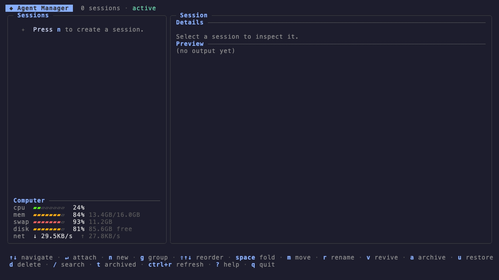
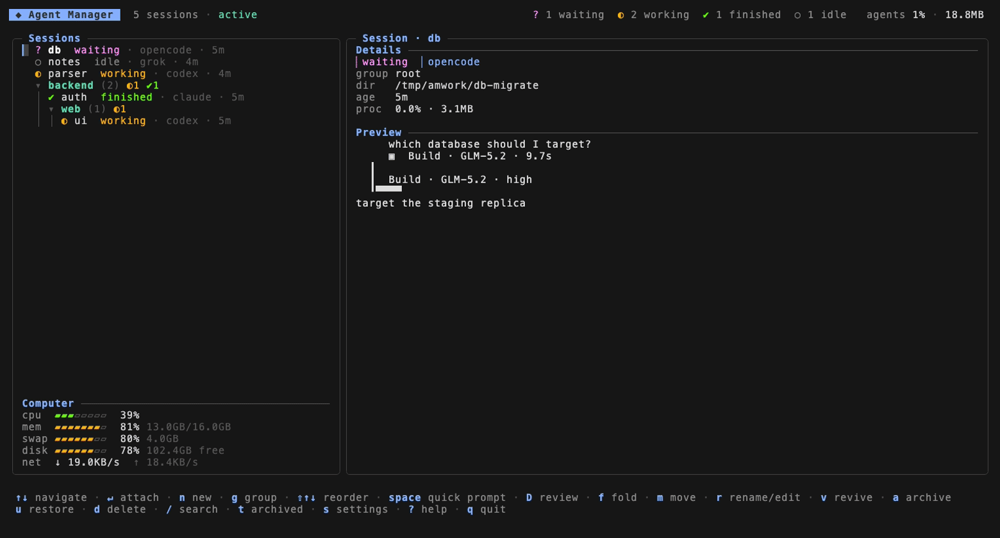

# Agent Manager



A terminal UI to manage AI coding-agent sessions on your machine. Create and enter sessions, organize them in a nested group tree with manual ordering, archive finished ones, and watch live status, a live pane preview, the combined footprint of your agents, and machine resource gauges.

## Supported tools

Status detection currently supports **Claude Code**, **OpenCode**, **Codex**, and **Grok Build** out of the box. Any other CLI tool can run as a session; add a `[tools.<name>]` block with status rules to get live status for it (see [Configuration](#configuration)).

## Install

### Homebrew (macOS / Linux)

```bash
brew install yoanwai/tap/agent-manager
```

Installs tmux with it if missing.

### Go

```bash
go install github.com/YoanWai/agent-manager@latest
```

Requires Go 1.26+ and tmux; installs to `$(go env GOPATH)/bin`.

### Prebuilt binaries

Download from [Releases](https://github.com/YoanWai/agent-manager/releases) (macOS and Linux, amd64/arm64).

### Windows

Run inside [WSL2](https://learn.microsoft.com/windows/wsl/install): agent-manager lives on tmux, which is a Linux/macOS tool. In a WSL shell, install with Homebrew or grab the Linux binary from Releases.

## Usage

```bash
agent-manager
```

Sessions run inside tmux (`am_*` namespace), so they survive the manager quitting. Inside a session, **Ctrl+Q** detaches back to the manager. `agent-manager --version` prints the version.

### Keys

| Key | Action |
|-----|--------|
| `n` | New session (name, tool, directory, optional starting prompt, group picker) |
| `g` | New group (name, parent, default path) |
| `enter` | Attach session / fold group |
| `ctrl+q` | Inside a session: back to the manager |
| `shift+↑` / `shift+↓` | Reorder session or group among its siblings |
| `m` | Move session to another group |
| `r` | Rename session / edit group (name and default path) |
| `v` | Revive a dead session (`revive_command`, e.g. `claude --continue`, resumes the conversation) |
| `a` / `u` | Archive / restore a session, or a group and its entire subtree |
| `d` | Delete session, or a group + its entire subtree |
| `space` | Quick prompt: answer the selected session, or spawn an agent in the selected group |
| `D` | Review the selected session's changes: full-screen whole-file diffs, line comments sent to the agent |
| `f` | Fold / unfold group |
| `s` | Settings (default tool for quick spawn) |
| `t` | Toggle archived view |
| `/` | Search |
| `?` | Help |
| `q` | Quit (sessions keep running) |

### Quick prompt

Press `space` to dock a prompt bar at the bottom of the sidebar. The target follows the cursor while the bar is open (`↑↓` still navigate):

- On a **session** row, `enter` sends the typed text straight into the session's pane, so the agent gets it as a user message without you attaching. The bar stays open and clears, ready for the next answer.
- On a **group** row, `enter` spawns a new agent in that group with the prompt embedded, using the group's default path. The spawn tool starts at the Settings (`s`) default and `tab` cycles it (claude ↔ opencode ↔ any configured tool); the footer shows the current pick. The agent starts working on the prompt immediately.

`esc` closes the bar. The new-session form's optional `prompt` field launches an agent the same way; tools whose CLI takes the prompt behind a flag declare it with `prompt_flag` (see [Configuration](#configuration)).

### Self-naming sessions

Sessions spawned without a custom name (every quick spawn, and the form with the name left blank) get a placeholder like `claude-a1b2`, and their first prompt opens by asking the agent to run `agent-manager rename "<name>"` with a short name describing the task. When the first prompt cannot carry the directive (a `/slash` command, or no prompt at all), the manager sends it as its own message once the tool's input box appears in the pane. The subcommand drops the name into a per-session file; the manager picks it up on the next poll and updates the sidebar row and the tmux status bar. This works with any tool, since it only needs the agent to read its prompt and run one shell command. You can also ask an agent to rename its session at any time, or run `agent-manager rename` yourself from a shell inside the session.

### Declaring the repo under review

A session's working directory is often an umbrella folder holding many repos, so review can only guess which one the agent means. An agent that knows which repo it is working in can say so by running `agent-manager review-repo <path>` from a shell inside its session. The subcommand checks that the path is (or sits inside) a git repo, resolves it to the repo root, and drops it into a per-session file; the manager picks it up on the next poll and review opens on that repo the next time you open it. A path that is not inside a git repo is rejected, so a declaration is always a fact rather than a guess.

An agent can also declare what its branch diffs against by running `agent-manager review-base <ref>` from inside its worktree: the ref is validated in that repo, stored per session and repo, and the "vs base" scope uses it from then on. `agent-manager review-base --clear` returns to automatic detection. A stored ref that stops resolving surfaces as an error in review, and `B` opens a base picker (the repo's branches plus an `auto` entry) to set or clear it by hand.

Agents usually work in git worktrees, one branch per worktree, and those worktrees can live anywhere on disk. A declared path that is a worktree root is accepted wherever it lives, so one `review-repo` call names both the repo and the branch under review. Review resolves its target in a fixed order: a repo you picked by hand with `r` or `b` wins for as long as the manager is running, then the agent's declared repo, then the ranking (dirty working trees first, then most recent commit). When the picked or declared path stops being a git repo, review says so in the status line and `r` is there to pick the right one.

### Diff review

Press `D` or `ctrl+r` on a session to open a full-screen review of its repo: changed files with +/− counts on the left, the whole file on the right with syntax highlighting and changed lines tinted, so every edit reads in full context. Arrow keys and `ctrl+d`/`ctrl+u` scroll the file, `J`/`K` switch files, `n`/`N` jump between changes, `u` toggles unified and side-by-side, `s` cycles the scope (uncommitted, vs base, last commit, staged), and `space` marks a file reviewed. When the working directory holds several repos, `r` opens a picker you type to filter, and `b` lists the current repo's worktrees by branch name so you can review another branch with one keypress. `B` picks the base the "vs base" scope compares against. The diff refreshes as the agent keeps editing.

Press `c` on a line to write a comment; `C` flattens every comment into one review prompt and sends it straight into the agent's pane, so the agent starts addressing your notes while you watch the diff update. `esc` closes the review.



### Groups

Groups are paths (`backend/api/auth`) forming a tree of unlimited depth. Sessions can live at any node, including the root. Create subgroups inline with `g`, reorder both groups and sessions with `shift+↑↓` (the order persists), fold a subtree with `f`, and edit a group's name and default path with `r`.

### Status

Each session's tmux pane is polled (default every 2s) to derive a status:

| Status | Meaning |
|--------|---------|
| `working` | The agent is busy on a turn |
| `waiting` | Blocked on you: a dialog, a permission ask, or a plain-text question |
| `finished` | Turn ended — an alert that clears to `idle` once you enter the session |
| `errored` | The tool reported an error |
| `idle` | Nothing running |
| `dead` | The tmux session is gone |

Detection matches per-tool regex rules against the visible pane, analyzes the newest turn to tell `finished` from `waiting`, and treats streaming output (content changing between polls) as `working`. A turn that ends without any turn-summary line still resolves: when a `working` pane goes quiet, the turn counts as `finished`, or `waiting` when it ends on a question. Polling keeps running while you are inside a session, so statuses stay live. The selected session's pane tail renders in the preview panel, and moving the cursor fetches the preview immediately.

For Claude Code, status comes first-hand from [hook events](https://docs.anthropic.com/en/docs/claude-code/hooks) instead of pane guessing: sessions launch with a generated `--settings` file whose hooks write the lifecycle state (`working`, `waiting`, `finished`, `idle`) to a per-session status file that the poller reads first. Pane rules still refine it — hooks cannot see a plain-text question, an Esc interrupt, or an error line, so a matching pane verdict upgrades the hook status — and they take over fully as fallback when the hook file is missing or stale. Enabled per tool with `status_source = "claude-hooks"`.

### Stats

The header shows a fleet summary: per-status session counts, plus `agents N% · X GB`, the combined CPU and RSS memory of every live agent's full process tree (shell, agent, and children). Agent CPU uses `ps` semantics where 100% equals one full core, so the total can exceed 100% on multi-core machines. The Computer block in the sessions panel shows machine gauges: CPU (normalized to the whole machine, capped at 100%), memory (used/total), swap, root-disk free space, and network up/down rates.

## Configuration

Config lives in your OS user config dir (`~/Library/Application Support/agent-manager/config.toml` on macOS, `~/.config/agent-manager/config.toml` on Linux) and is created on first run with working defaults for Claude Code, OpenCode, Codex, and Grok Build.

Top-level: `poll_interval` (default `"2s"`) sets how often panes are polled for status, preview, and stats.

Add any CLI tool as a `[tools.<name>]` block:

```toml
[tools.mytool]
command = "mytool"
default_status = "idle"
rules = [
  { state = "working", pattern = "esc to interrupt" },
  { state = "errored", pattern = "(?im)^\\s*error:" },
]
```

Rules match top-down against the visible pane text; first match wins, and `default_status` applies when nothing matches. Optional per-tool fields refine detection: `activity_cutoff` (regex locating the tool's input box, everything above it is turn content), `turn_end` (a turn-summary line marking the turn as over), `chrome_line`, `blocked_line`, and `trailing_note`. The generated config's `claude` and `opencode` blocks show all of them in use.

Other per-tool fields: `revive_command` is what `v` runs to revive a dead session (e.g. `claude --continue` resumes the conversation in place); `status_source = "claude-hooks"` switches status to Claude Code hook events (see [Status](#status)).

`prompt_flag` controls how the new-session form's optional prompt is embedded into the launch command. Tools that take the prompt as a positional argument (Claude Code: `claude 'the prompt'`) leave it empty; tools whose positional argument means something else declare the flag (OpenCode: `prompt_flag = "--prompt"`, since its positional argument is the project path). The prompt only shapes the launch command; revive (`v`) uses `revive_command` untouched.

State is stored next to the config in `state.db` (SQLite).

## Development

```bash
go test ./...   # includes end-to-end tests against a real tmux server
go run .
```

## License

[MIT](LICENSE)
