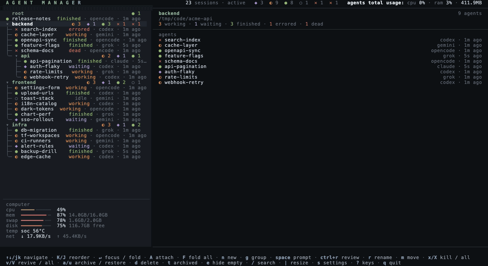
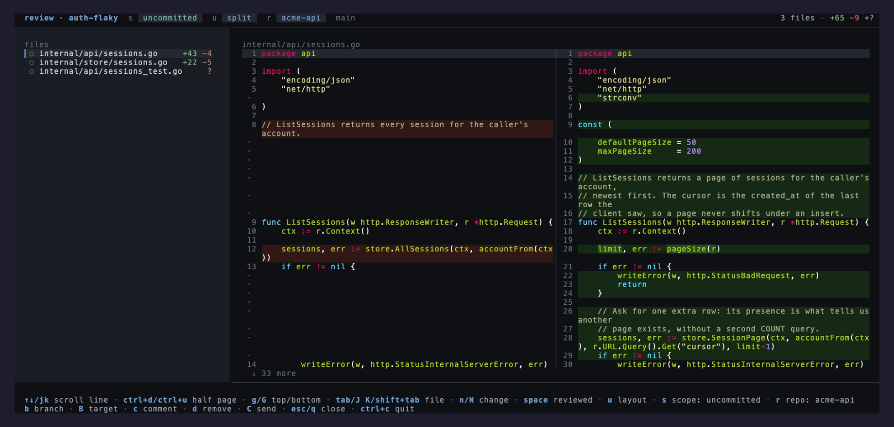
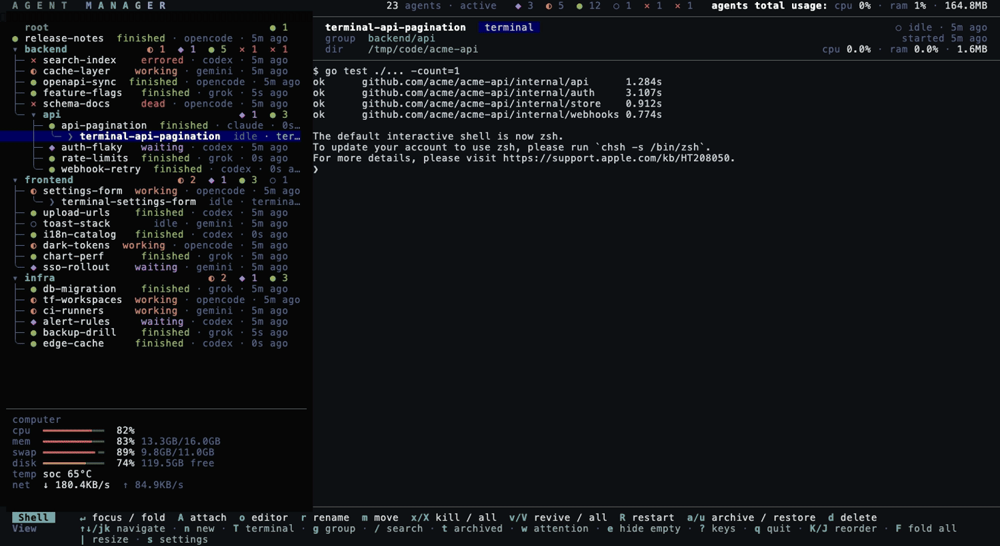
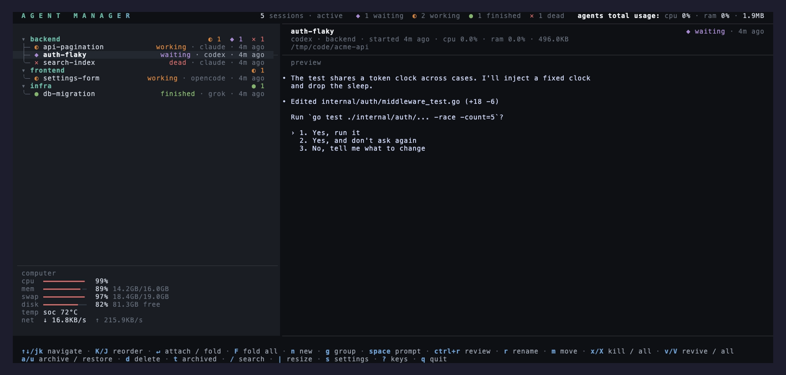
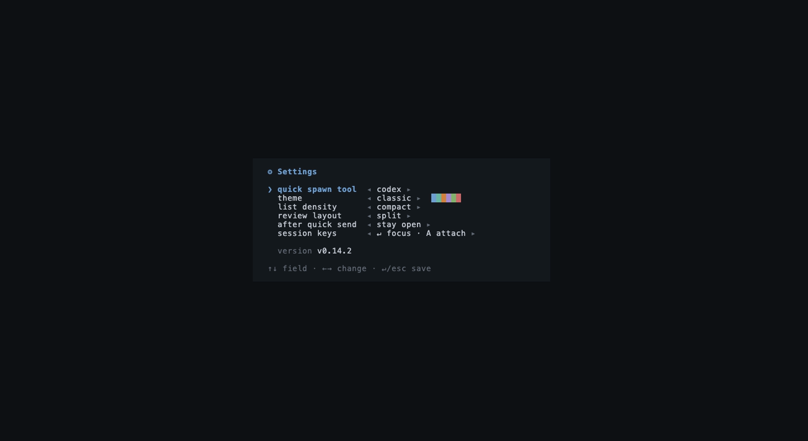

<h1 align="center">Agent Manager</h1>

<p align="center"><b>Run every AI coding agent from one terminal.</b></p>

<p align="center">
  <a href="https://github.com/YoanWai/agent-manager/actions/workflows/ci.yml"></a>
  <a href="https://github.com/YoanWai/agent-manager/releases/latest"></a>
  
  <a href="go.mod"></a>
  <a href="LICENSE"></a>
</p>



Claude Code, Codex, OpenCode, and Grok run side by side, each in its own tmux session, so they keep working after you quit the manager.

Instead of hunting through terminal tabs to see which agent is done and which is stuck, every session shows up in one list with live status, grouped into a project tree you can fold and reorder. You answer any of them without attaching: `space` sends a prompt straight into a session's pane, or spawns a new agent in the selected group. A dead session revives on its own conversation with `v`. And `ctrl+r` opens a full-file diff of what an agent changed, syntax-highlighted, where the comments you leave on lines go back to the agent's pane as one review prompt when you press `C`.

Not here yet: worktree creation, cost tracking, mouse-driven navigation, and agents that can talk to each other.

**Jump to:** [Install](#install) · [Keys](#keys) · [Quick prompt](#quick-prompt) · [Diff review](#diff-review) · [Status](#status) · [Configuration](#configuration)

Not here yet: worktree creation, cost tracking, mouse support, and agents that can talk to each other.

## Supported tools

Status detection currently supports **Claude Code**, **OpenCode**, **Codex**, and **Grok Build** out of the box. Any other CLI tool can run as a session; add a `[tools.<name>]` block with status rules to get live status for it (see [Configuration](#configuration)).

## Install

### Homebrew (macOS / Linux)

```bash
brew install yoanwai/tap/agent-manager
```

Installs tmux with it if missing. The tap ships a cask, so an install from the older formula switches over with `brew uninstall agent-manager` followed by the command above.

### Install script (macOS / Linux)

```bash
curl -fsSL https://raw.githubusercontent.com/YoanWai/agent-manager/main/install.sh | sh
```

Downloads the latest release for your platform, verifies it against the published checksums, and installs it to `~/.local/bin`. Set `AGENT_MANAGER_INSTALL_DIR` for another directory and `AGENT_MANAGER_VERSION` to pin a version. Install tmux with your own package manager.

### Arch Linux

```bash
yay -S agent-manager-bin
```

[agent-manager-bin](https://aur.archlinux.org/packages/agent-manager-bin) in the AUR installs the released binary and pulls in tmux and git.

### mise

```bash
mise use -g ubi:YoanWai/agent-manager
```

Reads the GitHub release directly, so it needs no registry entry. Install tmux with your own package manager.

### Go

```bash
go install github.com/YoanWai/agent-manager@latest
```

Requires Go 1.26+ and tmux 3.0+; installs to `$(go env GOPATH)/bin`.

### Prebuilt binaries

Download from [Releases](https://github.com/YoanWai/agent-manager/releases) (macOS and Linux, amd64/arm64).

### Windows

Run inside [WSL2](https://learn.microsoft.com/windows/wsl/install): agent-manager lives on tmux, which is a Linux/macOS tool. In a WSL shell, install with the install script above, with Homebrew, or grab the Linux binary from Releases.

### Updating

The manager checks GitHub Releases once a day and shows a `↑ vX.Y.Z available` badge in the header when a newer version is out. Pull it in the way you installed:

```bash
brew upgrade yoanwai/tap/agent-manager                                                    # Homebrew
curl -fsSL https://raw.githubusercontent.com/YoanWai/agent-manager/main/install.sh | sh   # Install script
mise upgrade --bump ubi:YoanWai/agent-manager                                             # mise
go install github.com/YoanWai/agent-manager@latest                                        # Go
```

## Usage

```bash
agent-manager
```

Sessions run inside tmux (`am_*` namespace), so they survive the manager quitting. Inside a session, **Ctrl+Q** detaches back to the manager and **Ctrl+R** opens its diff review. `agent-manager --version` prints the version.

Agent sessions live on a private tmux server named `agentmgr`, so they never mix with the tmux you run yourself and a `kill-server` on your own socket leaves them alone. To reach one from a plain shell, name that server: `tmux -L agentmgr ls`, then `tmux -L agentmgr attach -t am_<id>`.

### Keys

| Key | Action |
|-----|--------|
| `n` | New session (name, tool, directory, optional starting prompt, group picker) |
| `g` | New group (name, parent, default path) |
| `enter` | Attach session / fold group |
| `ctrl+q` | Inside a session: back to the manager |
| `K` / `J` (or `shift+↑` / `shift+↓`) | Reorder session or group among its visible siblings |
| `m` | Move session to another group |
| `r` | Rename session / edit tool; edit group name and default path |
| `x` | Kill the selected session, or every live session under a group: frees the RAM their agents hold, and the rows stay for `v` |
| `X` | Kill every live session in view |
| `v` | Revive a dead session, or every dead session under a group |
| `V` | Revive every dead session in view |
| `a` / `u` | Archive / restore a session, or a group and its entire subtree |
| `d` | Delete session, or a group + its entire subtree |
| `space` | Quick prompt: answer the selected session, or spawn an agent in the selected group |
| `ctrl+r` | Review the selected session's changes: full-screen whole-file diffs, with `c` to comment a line and `C` to send the comments to the agent |
| `F` | Fold / unfold every group |
| `s` | Settings (quick-spawn tool, theme, review layout, after quick send) |
| `\|` | Resize the split: `←→` nudge the divider, `enter` commits, `esc` cancels |
| `t` | Toggle archived view |
| `/` | Search |
| `?` | Help |
| `q` | Quit (sessions keep running) |

The wheel scrolls the list and the diff. Mouse tracking stays off so click-drag keeps selecting text natively in your terminal, which is why the pointer does not move the selection ([#110](https://github.com/YoanWai/agent-manager/issues/110)).

### Quick prompt

Press `space` to dock a prompt bar at the bottom of the sidebar. The target follows the cursor while the bar is open (`↑↓` still navigate):

- On a **session** row, `enter` sends the typed text straight into the session's pane, so the agent gets it as a user message without you attaching. The bar clears and stays open, ready for the next answer; Settings (`s`) can make it close instead.
- On a **group** row, `enter` spawns a new agent in that group with the prompt embedded, using the group's default path. The spawn tool starts at the Settings default and `tab` cycles it (claude ↔ opencode ↔ any configured tool); the footer shows the current pick. The agent starts working on the prompt immediately.

`ctrl+v` pastes an image from the system clipboard as an `[Image #1]` chip at the caret. The image is saved under `agent-manager-pastes` in your temp directory, and on send each chip is swapped back for its path, so the paths reach the agent in the order and the places you pasted them. `backspace` next to a chip removes the whole chip, and an edit that swallows one releases its image. A clipboard holding text rather than an image pastes as text.

`esc` closes the bar. The new-session form's optional `prompt` field launches an agent the same way; tools whose CLI takes the prompt behind a flag declare it with `prompt_flag` (see [Configuration](#configuration)).

### Killing and reviving sessions

`x` ends a session that is holding RAM you want back, and on a group row it ends every live session under it; `X` ends every live session in view. Each asks to confirm first, and what it ends is the tmux session, not the record: the row stays in the tree, marked `dead`, with its name, group, and conversation id intact.

`v` relaunches a dead session under its old id, keeping its name, group, and history. When the manager holds that session's own conversation id, revive resumes **that exact conversation** through the tool's `resume_by_id_command`: `claude --resume {id}`, `codex resume {id}`, `opencode --session {id}`, `grok --resume {id}`.

The id arrives one of two ways: tools with a `session_id_flag` launch under an id the manager mints, and tools that mint their own are read back by a `session_store` capturer (`codex`, `opencode`). Without an id, revive falls back to `revive_command` (`claude --continue`), which resumes the working directory's most recent conversation, and the manager says so in the status line, since sessions sharing a directory would otherwise land on the wrong one. On a group row `v` revives every dead session under it, and `V` revives every dead session in view; both revive what they can and name the first failure rather than stopping.

### Self-naming sessions

Sessions spawned without a custom name (every quick spawn, and the form with the name left blank) get a placeholder like `claude-a1b2`, and their first prompt opens by asking the agent to run `agent-manager rename "<name>"` once with a short name for the broad feature of the session (not a single subtask). The directive also tells the agent not to rename again unless you ask. When the first prompt cannot carry the directive (a `/slash` command, or no prompt at all), the manager sends it as its own message once the tool's input box appears in the pane. The subcommand drops the name into a per-session file; the manager picks it up on the next poll and updates the sidebar row and the tmux status bar. This works with any tool, since it only needs the agent to read its prompt and run one shell command.

Sessions you name yourself keep that name: the first prompt only notes that `agent-manager rename` is available later if you ask, and does not instruct the agent to rename now. You can still ask an agent to rename its session later, or run `agent-manager rename` yourself from a shell inside the session.

### Declaring the repo under review

A session's working directory is often an umbrella folder holding many repos, so review can only guess which one the agent means. An agent that knows which repo it is working in can say so by running `agent-manager review-repo <path>` from a shell inside its session. The subcommand checks that the path is (or sits inside) a git repo, resolves it to the repo root, and drops it into a per-session file; the manager picks it up on the next poll and review opens on that repo the next time you open it. A path that is not inside a git repo is rejected, so a declaration is always a fact rather than a guess.

An agent can also declare what its branch diffs against by running `agent-manager review-base <ref>` from inside its worktree: the ref is validated in that repo, stored per session and repo, and the "vs target" scope uses it from then on. `agent-manager review-base --clear` returns to automatic detection. A stored ref that stops resolving surfaces as an error in review, and `B` opens a target picker (the repo's branches plus an `auto` entry) to set or clear it by hand.

Agents usually work in git worktrees, one branch per worktree, and those worktrees can live anywhere on disk. A declared path that is a worktree root is accepted wherever it lives, so one `review-repo` call names both the repo and the branch under review. Review resolves its target in a fixed order: a repo you picked by hand with `r` or `b` wins for as long as the manager is running, then the agent's declared repo, then the ranking (dirty working trees first, then most recent commit). When the picked or declared path stops being a git repo, review says so in the status line and `r` is there to pick the right one.

### MCP: how agents discover these commands

Every session the manager spawns or revives carries the agent-manager MCP server, so MCP-capable agents see `rename`, `review_repo`, `review_base` and `review_mode` (which sets the diff scope review opens on) as native tools with descriptions telling them when to call each: no prompt injection, no per-project setup. The server lives in the same binary (`agent-manager mcp`, stdio) and identifies the calling session through its environment.

Registration is per tool. The built-in claude, codex, opencode and grok tools register automatically: claude gets a generated `--mcp-config` file, codex gets `-c mcp_servers...` overrides, opencode gets an `OPENCODE_CONFIG` merge file, and grok gets a one-time `grok mcp add --scope user` entry on its first launch. A custom tool opts in with `mcp = "<style>"` in its config section, or out with `mcp = "none"`. The `rename`, `review-repo` and `review-base` CLI subcommands keep working everywhere, MCP or not.

### Diff review

Press `ctrl+r` on a session to open a full-screen review of its repo: changed files with +/− counts on the left, the whole file on the right with syntax highlighting and changed lines tinted, so every edit reads in full context. The diff refreshes as the agent keeps editing.

| Key | Action |
|-----|--------|
| `↑↓` / `jk`, `ctrl+d` / `ctrl+u` | Scroll the file |
| `g` / `G` | Jump to top / bottom |
| `J` / `K` (or `tab` / `shift+tab`) | Previous / next file |
| `n` / `N` | Jump between changes |
| `u` | Toggle unified and side-by-side |
| `s` | Cycle the scope: uncommitted, vs target, last commit, staged |
| `r` | Pick the repo when the session's directory holds several (type to filter) |
| `b` | Pick the branch from the repo's worktrees |
| `B` | Pick the target (merge-into branch) the "vs target" scope compares against |
| `space` | Mark a file reviewed |
| `c` / `d` | Write / drop a line comment |
| `C` | Send every comment to the agent as one review prompt (`enter` or `y` confirms) |
| `esc` / `q` | Close the review |

Each changeable value in the header wears its own key, so the scope, layout, repo, and target pills read as `s`, `u`, `r`, `B` legends at a glance.



Comments stay on the review screen until you send them: `C` flattens every one of them into a single prompt, asks you to confirm, and delivers it into the agent's pane, so the agent starts addressing your notes while you watch the diff update.



### Groups

Groups are paths (`backend/api/auth`) forming a tree of unlimited depth. Sessions can live at any node, including the root. Create subgroups inline with `g`, reorder both groups and sessions with `K` / `J` (or `shift+↑↓`; the order persists), fold a subtree with `enter` on its row, fold or unfold the whole tree with `F`, and edit a group's name and default path with `r`. On a session, `r` renames it and `tab` cycles the tool (status rules and revive follow the new tool; useful when you quit one agent in the pane and start another).

### Status

Each session's tmux pane is polled (default every 2s) to derive a status:

| Status | Meaning |
|--------|---------|
| `working` | The agent is busy on a turn |
| `waiting` | Blocked on you: a dialog, a permission ask, or a plain-text question |
| `finished` | Turn ended — an alert that clears to `idle` once you enter the session |
| `errored` | The tool reported an error |
| `idle` | Nothing running |
| `dead` | The tmux session is gone |



Each row carries its status and tool inline, and a folded group keeps a count per status so a collapsed subtree still tells you whether anything needs you. Selecting a session shows the tail of its pane on the right, which is how a `waiting` agent's actual question reaches you without attaching. A session with no window left, archived or killed, shows the snapshot taken when it still had one.

Detection matches per-tool regex rules against the visible pane, analyzes the newest turn to tell `finished` from `waiting`, and treats streaming output (content changing between polls) as `working`. A turn that ends without any turn-summary line still resolves: when a `working` pane goes quiet, the turn counts as `finished`, or `waiting` when it ends on a question. Work that outlives the turn which started it (background agents) is matched by `busy_line`, so a turn-end summary keeps reading as `working` while that work runs. Polling keeps running while you are inside a session, so statuses stay live. The selected session's pane tail renders in the preview panel, and moving the cursor fetches the preview immediately.

For Claude Code, status comes first-hand from [hook events](https://docs.anthropic.com/en/docs/claude-code/hooks) instead of pane guessing: sessions launch with a generated `--settings` file whose hooks write the lifecycle state (`working`, `waiting`, `finished`, `idle`) to a per-session status file that the poller reads first. Pane rules still refine it — hooks cannot see a plain-text question, an Esc interrupt, or an error line, so a matching pane verdict upgrades the hook status — and they take over fully as fallback when the hook file is missing or stale. Enabled per tool with `status_source = "claude-hooks"`.

### Stats

The header shows a fleet summary: per-status session counts, plus `agents total usage: cpu N% · ram M% · X GB` for every live agent's full process tree (shell, agent, and children). CPU is that tree's CPU time over the last poll as a share of total machine capacity (same 0–100% unit as the computer gauge). RAM is resident set as a share of installed memory, with absolute size beside it. The selected session's detail line uses the same scale for that session alone.

The Computer block in the sessions panel shows machine gauges:

- **CPU**: whole-machine utilization (0-100%)
- **Memory**: used/total. On macOS this matches Activity Monitor's Memory Used (resident RAM minus free, speculative, and reclaimable file cache). On Linux it is `Total - MemAvailable`, so file cache is not counted as used.
- **Swap**: used/total of the current swap allocation (`used/total * 100`). On macOS the swap file grows under pressure, so the denominator is the live size from `vm.swapusage`, not a fixed partition.
- **Disk**: fill of the root filesystem (used / (used + available)), with free space from the kernel's available figure
- **Network**: up/down rates on real NICs only (loopback, utun, bridges, and similar virtual interfaces are excluded)
- **Temperature**: `cpu`, `gpu` and `soc` readings in °C, each the hottest sensor in its category, sampled every 5s. Apple Silicon draws no CPU/GPU line, so its dies report as one `soc` figure. A reading appears when the machine exposes that sensor.

### Themes

`s` opens Settings, where `↑↓` move between fields and `←→` change the focused one.



Nine palettes ship: `classic`, `solarized dark`, `catppuccin mocha`, `tokyo night`, `gruvbox dark`, `nord`, `dracula`, `rosé pine`, and `monochrome`. The swatch strip beside the name previews the palette, and the theme applies as you step through it, so the picker is a live preview of the whole UI. The manager also matches the terminal's own background to the palette, so the window has no seam against it, and restores the terminal's background on exit. Your pick is saved with the rest of the state and restored on the next run.

## Configuration

Config lives in your OS user config dir (`~/Library/Application Support/agent-manager/config.toml` on macOS, `~/.config/agent-manager/config.toml` on Linux) and is created on first run with working defaults for Claude Code, OpenCode, Codex, and Grok Build.

Top-level: `poll_interval` (default `"2s"`) sets how often panes are polled for status, preview, and stats.

Add any CLI tool as a `[tools.<name>]` block:

```toml
[tools.mytool]
command = "mytool"
default_status = "idle"
rules = [
  { state = "working", pattern = "esc to interrupt" },
  { state = "errored", pattern = "(?im)^\\s*error:" },
]
```

Rules match top-down against the visible pane text; first match wins, and `default_status` applies when nothing matches.

**Status detection.** Optional per-tool fields refine it: `activity_cutoff` (regex locating the tool's input box, everything above it is turn content), `turn_end` (a turn-summary line marking the turn as over), `busy_line` (work that outlives its turn, such as background agents), `chrome_line`, `blocked_line`, and `trailing_note`. `status_source = "claude-hooks"` switches status to Claude Code hook events (see [Status](#status)). The generated config's `claude` and `opencode` blocks show all of them in use.

**Revive.** `resume_by_id_command` resumes one exact conversation, with `{id}` replaced by the session's captured agent id. That id comes either from launching under an id the manager mints (`session_id_flag`, e.g. `--session-id`) or from reading back an id the tool minted itself (`session_store = "codex" | "opencode"`). `revive_command` is what `v` falls back to when no id is available, e.g. `claude --continue`.

**Prompts.** `prompt_flag` controls how the new-session form's optional prompt is embedded into the launch command. Tools that take the prompt as a positional argument (Claude Code: `claude 'the prompt'`) leave it empty; tools whose positional argument means something else declare the flag (OpenCode: `prompt_flag = "--prompt"`, since its positional argument is the project path). The prompt only shapes the launch command; revive (`v`) uses the revive commands untouched.

**MCP.** `mcp = "claude" | "codex" | "opencode" | "grok" | "none"` picks how the agent-manager MCP server is registered into the tool's sessions (see [MCP](#mcp-how-agents-discover-these-commands)). An empty value uses the tool's config key when it names a known style.

State is stored next to the config in `state.db` (SQLite).

## Development

```bash
go test ./...   # includes end-to-end tests against a real tmux server
go run .
```

## Contributing

Bug reports, feature ideas, and pull requests are welcome. See [CONTRIBUTING.md](.github/CONTRIBUTING.md) for setup and the checks CI runs. Questions and setups worth sharing go in [Discussions](https://github.com/YoanWai/agent-manager/discussions). Security reports go through a [private advisory](https://github.com/YoanWai/agent-manager/security/advisories/new); see [SECURITY.md](.github/SECURITY.md).

## License

[MIT](LICENSE)
